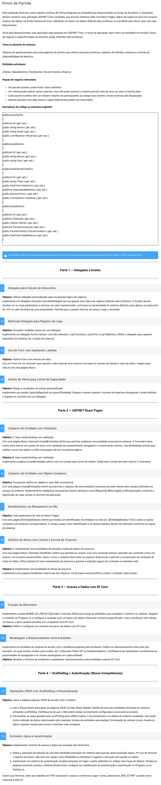

# Fundamentos de Desenvolvimento com C#
# AT - Questões (12)
Modo de Uso:
- Item5 - Página Destino.
- Item6 - Página Cliente>Create.
- Item7 - A clicar enm Detalhes do Cliente ou ao clicar em um Pacote Turistico ja cadastrado na página Create PacoteTurístico.
- Item8 - Páginas SaveNotes e ViewNotes.
- Item9 - Arquivo Data>AgenciaContext.cs com database em SQLServer.
- Item10 - Pasta Migrations com os registros de migração do banco de dados.
- Item11 - pasta Pages>Cliente estão as operações de CRUD (Create, Edit, Delete)
Na página Pages>Index esta a operação(Read) do CRUD
- Para executar o código, basta abrir o arquivo Program.cs e descomentar o exercício que deseja executar e Iniciar a aplicação.

