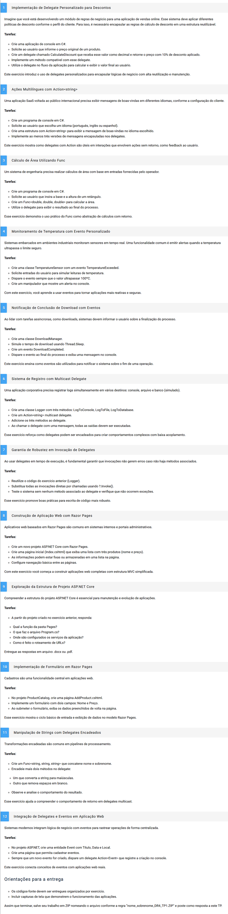

# Desenvolvimento Web com .NET e Bases de Dados
# TP1 - Questões (12)
**Modo de Uso:** 
**Pra as questões 01,02,03,04,05,06,07 e 11.**
- Existe o projeto TP1 com um arquivo "Program.cs", que é o arquivo principal do projeto.
- Para executar o código, basta abrir o arquivo Program.cs e descomentar o exercício que deseja executar e Iniciar a aplicação.

**Pra as questões 09.**
- Olhar o pdf, na pasta documentos>samuel_hermany_DR4_TP1.pdf, esté respondida no documento a questão.
 
**Pra as questões 08, 10 e 12 ao rodar a página é possível navegar entre as 3 páginas.**
- Existe o projeto RazorPage_TP1 com 3 páginas.
- Exercício 08 - Home_08 - Pages>index.cshtml.
- Exercício 10 - Catálogo de Produtos_10 - Pages>ProductCatalog>AddProduct.cshtml.
- Exercício 12 - Eventos_12 - Pages>Exercicio_12>Eventos.cshtml.

