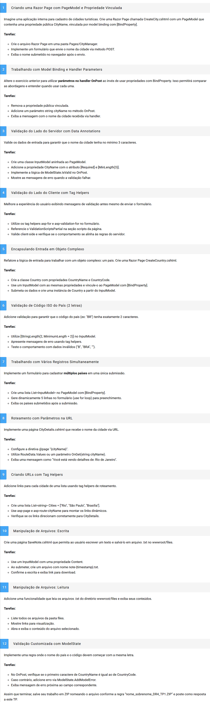

# Desenvolvimento Web com .NET e Bases de Dados
# TP2 - Questões (12)
**Modo de Uso:**
- Na solução existe um projeto para cada Exercício.
- Para executar o código, basta torna o projeto escolhido como inicial e Iniciar a aplicação.

