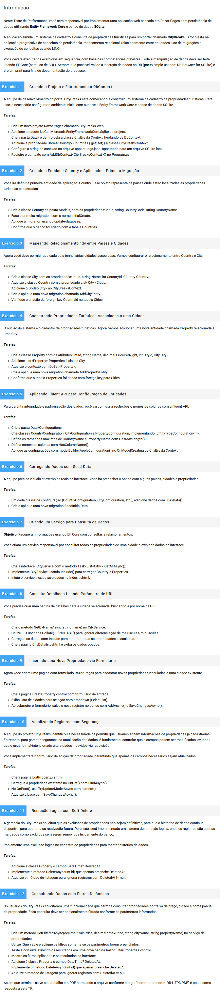

# Desenvolvimento Web com .NET e Bases de Dados
# TP3 - Questões (12)
Modo de Uso:
- No projeto existe um arquivo "Program.cs", que é o arquivo principal do projeto.
- Para executar o código, basta abrir o arquivo Program.cs e descomentar o exercício que deseja executar e Iniciar a aplicação.

